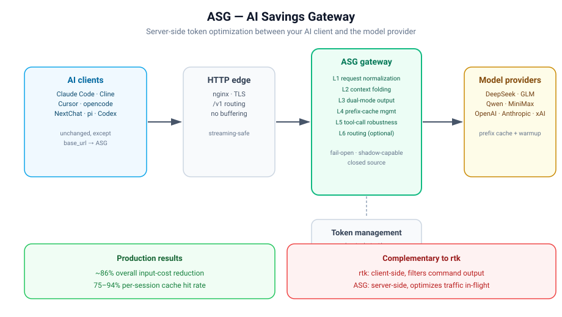

# ASG — AI Savings Gateway

**Cut AI coding costs by up to 86% — at the gateway, not the client.**

ASG is a production-grade **server-side API gateway** that optimizes LLM traffic in-flight. It sits between your coding agents (Claude Code, Cline, Cursor, NextChat, …) and your upstream model providers, and applies a stack of token-optimization layers that reduce spend — **without changing a single line of client code**.

> **This repository contains documentation only.** ASG is a closed-source commercial product. The source code is not published. This repo exists to explain the architecture, the optimization mechanisms, and the measured results, and to serve as the public technical home of the project.

---

## Why ASG exists

AI coding agents are token hogs. A single multi-turn session with tool calls can burn tens of thousands of input tokens per request — most of it **repetition**: the same system prompt, the same tool schemas, the same long conversation history, resent over and over, re-billed every turn.

Client-side tools (e.g. Rust CLI proxies) trim command output *before* it reaches the model. That helps — but it only covers one slice of the waste. The biggest slice happens **on the wire**, at the API layer:

- **Repetitive prefixes** — the same `system + tools` prefix is re-sent and re-priced every turn.
- **Exploding histories** — conversation context grows with every tool result and every retry.
- **Unconstrained outputs** — models emit verbose JSON blobs when the client only needs a compact result.
- **Broken tool calls** — malformed/empty `tool_calls` force retries that double the bill.

ASG attacks all four **server-side**, transparently, for every client that points at it.

---

## The optimization stack

| Layer | Mechanism | What it does | Where it saves |
|---|---|---|---|
| **L1** | Request normalization | Canonicalizes messages, sorts tool schemas, strips volatile fields | Raises provider prefix-cache hit rate |
| **L2** | Context folding | Compresses cold conversation history into compact `[FOLD]` markers | Shrinks per-turn input tokens |
| **Dual-Mode** | Output constraint | Injects a structural contract that makes the model emit compact output | Cuts output tokens |
| **Cache** | `cache_control` injection + warmup | Explicitly marks stable prefixes for provider caching and pre-warms them | Moves tokens from billed to cached |
| **Tool-call fix** | Empty-call cleanup + stream delta normalization | Removes garbage tool frames that force expensive retries | Eliminates whole wasted turns |
| **Routing** | Intent classification + rules | (Optional) routes requests to the cheapest capable model | Cuts unit price |

Measured on the production deployment: **~86% overall token-cost reduction**, with per-session prefix-cache hit rates of **75–94%** (peaks above 96%).

---

## Architecture at a glance



```
coding agents
  (Claude Code / Cline / Cursor / NextChat / …)
        │  OpenAI-compatible API
        ▼
   nginx :8888            public ingress, TLS, rate limiting, path routing
        │  /v1/chat/completions · /v1/messages
        ▼
   ASG Gateway :18788     the optimization brain (L1 + L2 + Dual-Mode + Cache + Tool-fix)
        │
        ▼
   Provider Relay :8140   auth, key management, upstream adapters
        │
        ▼
   Model providers        DeepSeek · GLM · Qwen · MiniMax · OpenAI · Anthropic · xAI · …
```

The optimization layers are **protocol-transparent**: clients talk a standard OpenAI-compatible or Anthropic Messages API, and upstreams receive a cleaned, compressed, cache-optimized request. Nothing about the client's request format has to change.

---

## Features

- **Multi-tenant** — per-user tokens, per-user model routing, per-user metrics.
- **Client-agnostic** — works with any OpenAI-compatible client; no agent-side install.
- **Provider-agnostic** — one gateway in front of DeepSeek, GLM, Qwen, MiniMax, OpenAI, Anthropic, xAI, Gemini.
- **Streaming-safe** — SSE passthrough with streaming `tool_calls` normalization.
- **Observable** — per-request savings, cache hit rates, cost, and latency tracking.
- **Fail-closed** — every optimization layer falls back to a transparent pass-through on error.

---

## Documentation

- [Overview & design goals](docs/getting-started/overview.md)
- [Quickstart — point a client at the gateway](docs/getting-started/quickstart.md)
- [Supported clients](docs/getting-started/supported-clients.md)
- [Configuration reference](docs/getting-started/configuration.md)
- [Concepts: how each optimization layer works](docs/concepts/)
- [Benchmarks & methodology](docs/benchmarks/)
- [Architecture (no code)](docs/contributing/ARCHITECTURE.md)
- [Technical deep dive](docs/contributing/TECHNICAL.md)
- [FAQ](docs/faq.md)
- [Examples](examples/): [nginx routing](examples/nginx-routing.conf.example), [client configs](examples/client-configs.md)

---

## License & source

- **This repository:** documentation only. © 2026 ASG. All rights reserved. See [LICENSE](LICENSE).
- **Source code:** closed-source, proprietary. Not published.
- **Contact:** open an issue or discussion — or reach the team for commercial licensing.

> ⚠️ This is a **public documentation repository for a commercial product**. The mechanisms described here are the product's intellectual property. If you are evaluating whether to build this yourself, note that the value is in the *implementation*, not the concept.
